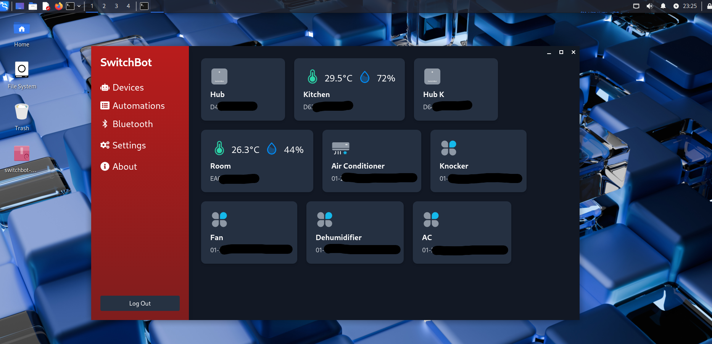
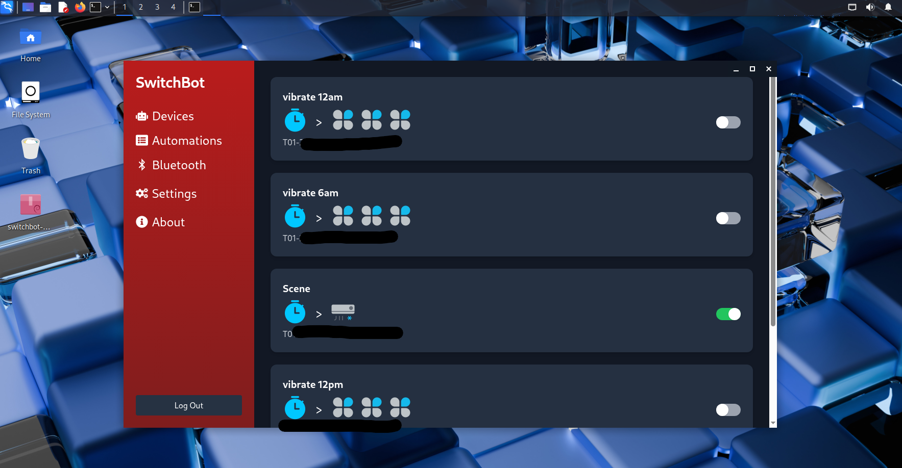
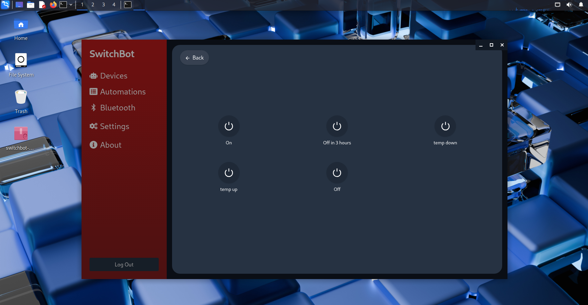

# SwitchBot Desktop App

There is currently no official desktop app for SwitchBot, so I’ve created one.

This application uses the **mobile API** (instead of the limited Open API available on GitHub), allowing it to support more features and eventually match the functionality of the official mobile app.

---

## 📸 Screenshots

  
  


---

## 💻 Desktop Application

Download the latest installer from the [Releases](../../releases) section.

Supported platforms:
- Windows
- macOS
- Linux

---

## 🌐 Web Application

### Multi-Device Setup

To access the app from multiple devices, set the following environment variable in `/client/.env`:

```env
REACT_APP_SERVER_URL=http://<your-server-ip>:8089
```

Replace `<your-server-ip>` with the actual IP address of the server hosting the backend.

---

## 💬 Discussions

Got questions, suggestions, or just want to chat? Join the discussion:  
👉 [Discussion Thread #1](https://github.com/dbghelp/SwitchBot-App/discussions/1)

---

## 🧪 Implementation & Testing

This app is developed and tested using only the SwitchBot devices I personally own.  
Support for other devices may vary.

---

## ☕️ Support / Donation

If you find this project helpful, consider donating to support its development.  
Your contribution is greatly appreciated!

---
